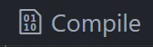
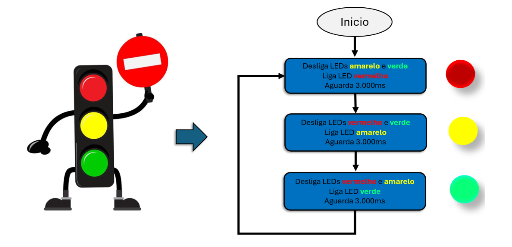
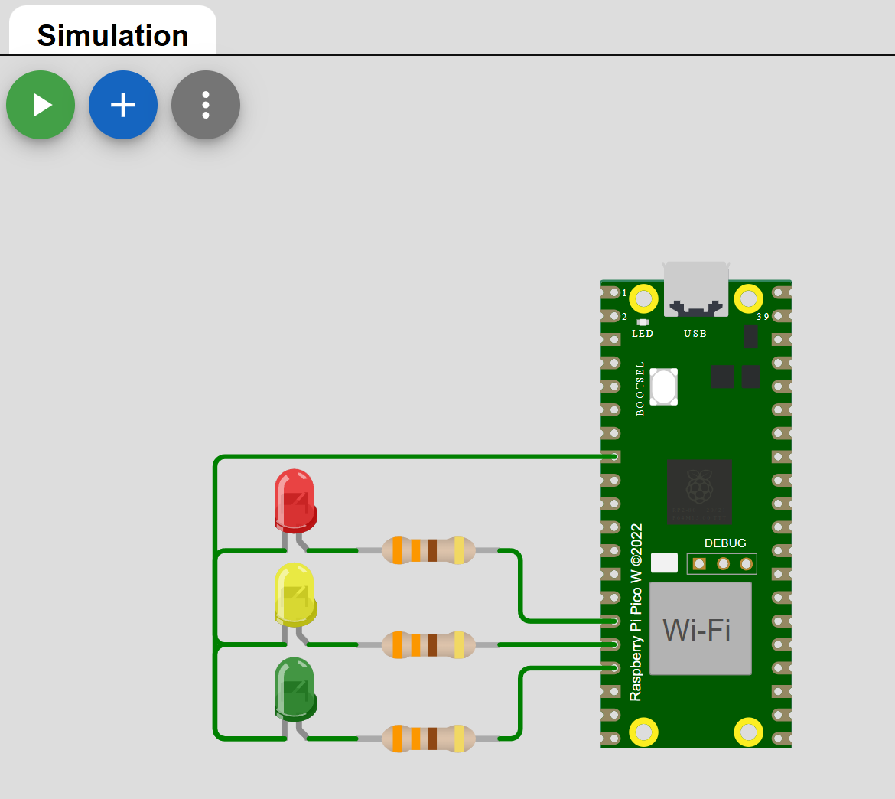
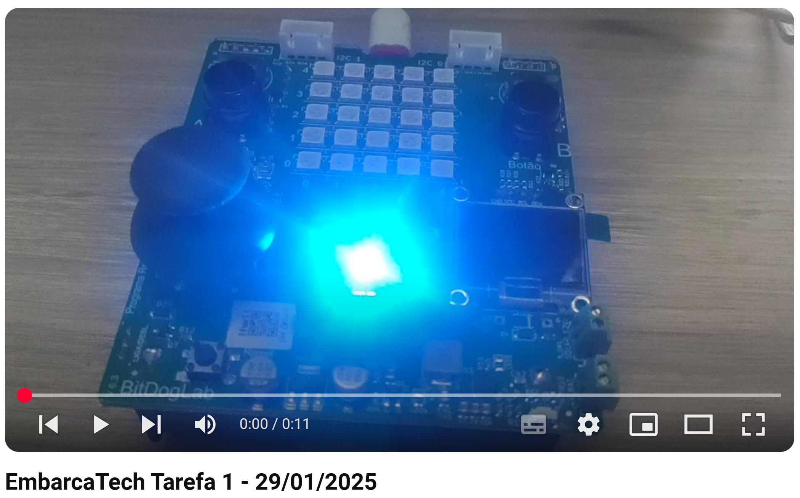

<h1 align="center">Embarcatec | Tarefa 1 Aula Sincrona 29/01/2025</h1>

<div align="center">  
  
</div>

## Objetivo do Projeto

Usando o Microcontrolador Raspberry Pi Pico W ao empregar a função add_repeating_timer_ms(), presente na ferramenta Pico SDK, foi projetado um semáforo com temporização de 3 segundos para cada alteração de sinal.

## 🗒️ Lista de requisitos

- Cabo USB
- Placa Bitdoglab ou os itens abaixo:
    - Protoboard;
    - Fios e jumpers; 
    - 03 LEDs (vermelho, amarelo e verde);
    - 03 Resistores de 330 Ω;
    - Microcontrolador Raspberry Pi Pico W; 

## 🛠 Tecnologias

1. **Git e Github**;
2. **VScode**;
3. **Linguagem C**;
4. **Extensões no VScode do Raspberry Pi Pico Project e CMake**

## 💻 Instruções para Importar, Compilar e Rodar o Código Localmente

Siga os passos abaixo para clonar o repositório, importar no VS Code usando a extensão do **Raspberry Pi Pico Project**, compilar e executar o código.

1. **Clone o repositório para sua máquina local**  
   Abra o terminal e execute os comandos abaixo:
   ```bash
   git clone https://github.com/alexsami-lopes/EmbarcaTech-Tarefa1-Aula-Sincrona-29-01-2025.git
   cd EmbarcaTech-Tarefa1-Aula-Sincrona-29-01-2025

2. **Abra o VS Code e instale a extensão "Raspberry Pi Pico Project" (caso não já a tenha instalada)**
 - No VS Code, vá até "Extensões" (Ctrl+Shift+X)
 - Pesquise por "Raspberry Pi Pico Project"
 - Instale a extensão oficial

3. **Importe o projeto no VS Code**
 - No VS Code, na barra lateral do lado esquerdo clique em "Raspberry Pi Pico Project" 
 - No menu que aparecer clique em 
 - Clicando em "Change" escolha a pasta clonada do repositório
 - Escolha a versão do SDK 2.1.0
 - Clique em "Import"


    


4. **Compile o projeto**
 - Com o projeto aberto no VS Code, pressione 
 - Aguarde a finalização do processo de build

5. **Rode o código no Raspberry Pi Pico**
 - Conecte o Raspberry Pi Pico ao PC segurando o botão "BOOTSEL".
 - Arraste e solte o arquivo `.uf2`, localizado dentro da pasta "build" do seu projeto, gerado na unidade USB montada.
 - O código será carregado automaticamente e o Pico será reiniciado.
 - Caso tenha instalado o driver com o Zadig clique em "Run" ao lado do botão 


## 🔧 Funcionalidades Implementadas:

1. O acionamento dos LEDs (sinais do semáforo) inicia na cor vermelha, conforme orientação presente na Figura 1, alterando para amarela e, em seguida, verde.
2. O temporizador foi ajustado para um atraso de 3 segundos (3.000ms).
3. A mudança de estado dos LEDs foi implementada na função de call-back do temporizador, a exemplo da rotina trabalhada na aula síncrona - repeating_timer_callback().
4. A rotina principal, presente no interior da estrutura de repetição while, imprime "rotina de repetição de 1 segundo\n" a cada segundo (1.000 ms).
5. Com o emprego da Ferramenta Educacional BitDogLab, foi feito um experimento com o código deste exercício utilizando o LED RGB – GPIOs 11, 12 e 13.

<div align="center">
  <figure>  
    
    
<figcaption>

**Figura 1** - Fluxograma simplificado de atuação do semáforo.
    </figcaption>
  </figure>
</div>

## 💻 Desenvolvedor
 
<table>
  <tr>

<td align="center"><br /><sub><b> Alexsami Lopes </b></sub></a><br />👨‍💻</a></td>

  </tr>
</table>


## 🎥 Demonstração no Wokwi: 

<div align="center">
  <figure>  
    
    
<figcaption>

**Figura 2** - Demo do Projeto no Wokwi.com - Acessível em: https://wokwi.com/projects/421980641816858625
    </figcaption>
  </figure>
</div>


## 🎥 Demonstração na Placa (Video): 

### As cores não equivalem às cores do semáforo na placa, pois a gpios sugeridas na tarefa não tem números equivalentes ao RGB da placa, no entanto, preferiu-se seguir à risca as instruções da tarefa.

<div align="center">
  <a href="https://youtu.be/pCgZTF2CAyA" target="_blank">
    
  </a>
</div>
